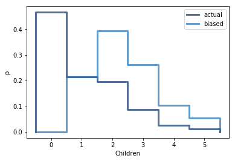

# [Think Stats Chapter 3 Exercise 1](http://greenteapress.com/thinkstats2/html/thinkstats2004.html#toc31) (actual vs. biased)

## Question
Something like the class size paradox appears if you survey children and ask how many children are in their family. Families with many children are more likely to appear in your sample, and families with no chil-
dren have no chance to be in the sample.

1. Use the NSFG respondent variable NUMKDHH to construct the actual distribution for the number of children under 18 in the household.
1. Now compute the biased distribution we would see if we surveyed the children and asked them how many children under 18 (including themselves) are in their household.
1. Plot the actual and biased distributions, and compute their means.

## Answer

### Code
```python
import sys
import numpy as np

# `ts2` is a sym-link to the `thinkstats2/code` directory (for me: `~ds/metis/metisgh/prework/ThinkStats2/code`)
# This allows us to `import` that code, and the imports in that code to work

sys.path.append('ts2')
import nsfg
import thinkstats2
import thinkplot


# Ingest the NSFG data
resp = nsfg.ReadFemResp(dct_file='ts2/2002FemResp.dct', dat_file='ts2/2002FemResp.dat.gz')

# Create the actual PMF
pmf = thinkstats2.Pmf(resp.numkdhh, label='actual')

# Create the biased PMF
biased_pmf = pmf.Copy(label='biased')
for val in biased_pmf.Values():
    biased_pmf[val] *= val

# Print the mean for both
print('\tMean')
print('actual',pmf.Mean(),sep='\t')
print('biased',biased_pmf.Mean(),sep='\t')

# Plot both PMFs
thinkplot.Pmfs([pmf,biased_pmf])
thinkplot.Config(xlabel='Children',ylabel='p')
```

### Output
```
        Mean
actual  1.024205155043831
biased  2.461860525971477
```

