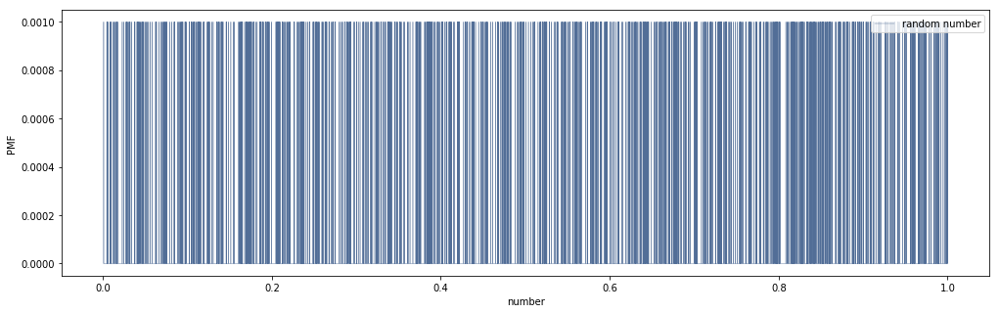
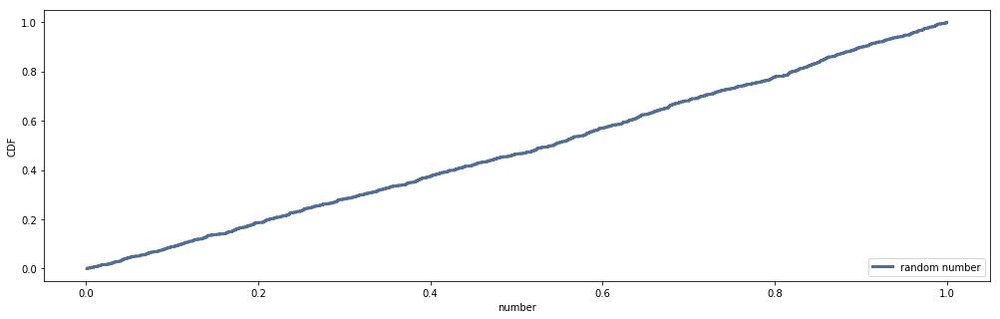

# [Think Stats Chapter 4 Exercise 2](http://greenteapress.com/thinkstats2/html/thinkstats2005.html#toc41) (a random distribution)

## Question
The numbers generated by random.random are supposed to be uniform between 0 and 1; that is, every value in the range should have the same probability.

* Generate 1000 numbers from random.random and plot their PMF and CDF.
* Is the distribution uniform?

## Answer

**Yes**, the distribution appears uniform.

### Code

```python
import sys
import numpy as np

#`ts2` is a sym-link to the `thinkstats2/code` directory (for me: `~ds/metis/metisgh/prework/ThinkStats2/code`)
#This allows us to `import` that code, and the imports in that code to work
sys.path.append('ts2')
import nsfg
import thinkstats2
import thinkplot

# Generate 1000 random numbers
sample = np.random.random(1000)

# Alternative that uses the builtin random.random() function
#import random as random
#sample = [random.random() for i in range(1000)

# Create PMF & CDF
pmf = thinkstats2.Pmf(sample,label='random number')
cdf = thinkstats2.Cdf(pmf)

# Plot PMF
thinkplot.Figure(figsize=(17,5))
thinkplot.Pmf(pmf,linewidth=.4,align='left')
thinkplot.Config(xlabel='number',ylabel='PMF',loc='upper right')

# Plot CDF
thinkplot.Figure(figsize=(17,5))
thinkplot.Cdf(cdf)
thinkplot.Config(xlabel='number',ylabel='CDF',loc='lower right')
```

### Output




